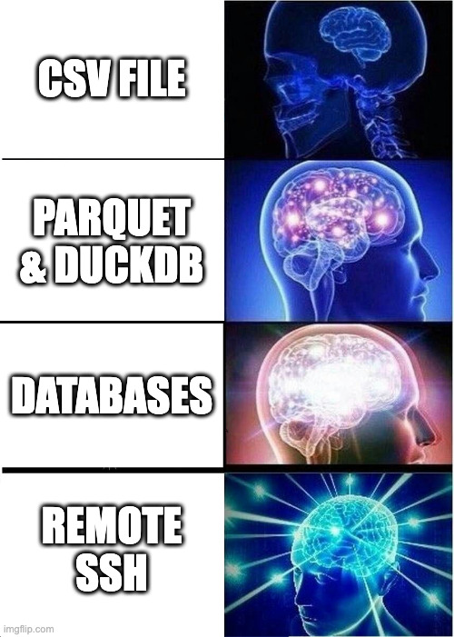

# useR-2025 

Slides for talk at [useR! 2025](https://user2025.r-project.org/program/in-person/) in August 2025

## Outgrowing your laptop with Positron

Have you ever run out of memory or time when tidying data, making a visualization, or training a model? An R user may find their laptop more than sufficient to start their journey with statistical computing, but as datasets grow in size and complexity, so does the necessity for more sophisticated tooling. This talk will step through a set of approaches to scale your tasks beyond in-memory analysis on your local machine, using the Postron IDE: adopting a lazy evaluation engine like DuckDB, connecting to remote databases with fluent workflows, and even migrating from desktop analysis entirely to server or cloud compute using SSH tunnelling. 

The transition away from a local, in-memory programming paradigm can be challenging for R users, who may not have much exposure to tools or training for these ways of working. This talk will explore available options which make crossing this boundary more approachable, and how they can be used with an advanced development environment suited for statistical computing with R. Integrations in the Positron IDE make all these tasks easier; for example, remote development in Positron allows an R user to seamlessly write code on their local machine, and execute that code on a remote host without tedious interactions outside the IDE. Whether you train statistical models, build interactive apps, or work with large datasets, after this talk you’ll walk away with techniques for doing it better with Positron.
